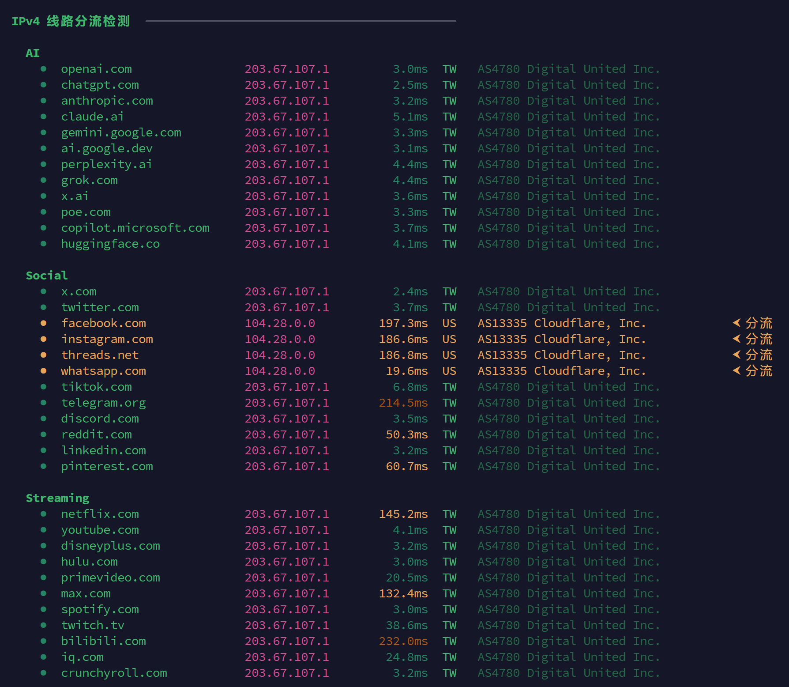
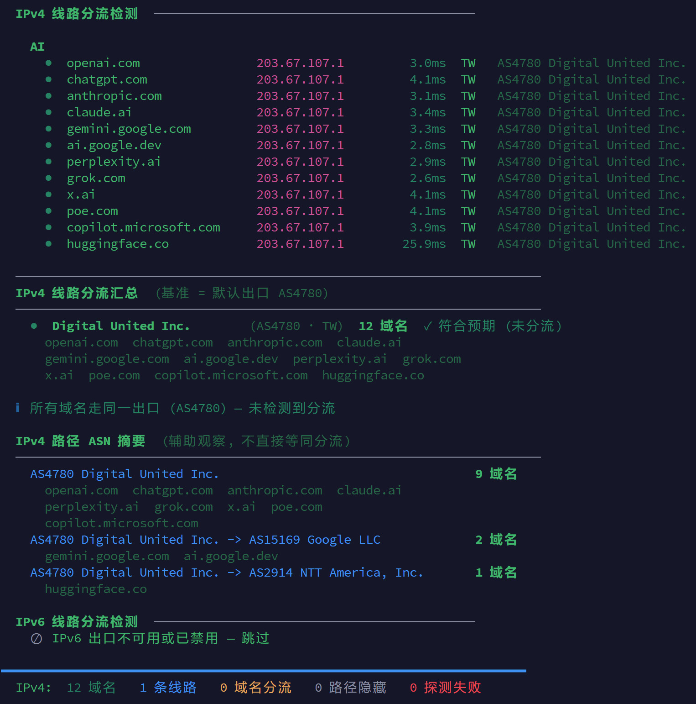

# 家宽VPS分流一键自查检测 Egress-Check

一条命令检测服务器 / 家宽出口是否存在分流，快速看出访问 Meta、流媒体、金融、电商等平台时，实际走的是不是同一条线路。

它适合用来验收“家宽 VPS / 原生家宽 / 不分流线路”这类服务：不用猜、不用问客服，直接把 100+ 个常见平台的出口线路、ASN 和延迟跑出来。

## 一键完成检测

复制下面这一行到 SSH 里运行：

```bash
bash <(curl -Ls https://raw.githubusercontent.com/cnprobe/egress-check/main/ip.sh) -I
```

运行后输入 `1-7` 选择检测模式：

```text
1) 默认完整检测      网络环境 + IPv4 + IPv6
2) 只检测 IPv4
3) 只检测 IPv6
4) 只检测指定分类    AI / Social / Streaming / Search / Developer / Cloud / Crypto / Gaming
5) 低并发低压力模式  根据CPU 自适应并发 + 减少探测包，更流畅
6) JSON 输出         适合 cron / 监控
7) 高并发日志模式    并发 10 + 关闭颜色
```

一键`完整分流`检测：

```bash
bash <(curl -Ls https://raw.githubusercontent.com/cnprobe/egress-check/main/ip.sh)
```

快速`AI分流`查询：

```bash
bash <(curl -Ls https://raw.githubusercontent.com/cnprobe/egress-check/main/ip.sh) --only AI
```

快速`社交媒体分流`查询：

```bash
bash <(curl -Ls https://raw.githubusercontent.com/cnprobe/egress-check/main/ip.sh) --only Social
```

## 核心卖点

- **一键验收家宽线路**：复制命令到 SSH，按菜单选择即可检测。
- **直接抓分流证据**：哪些域名走默认出口、哪些域名被甩到其他 ASN，一屏看清。
- **覆盖真实使用场景**：AI、社交、流媒体、金融、电商、开发者平台、云服务、游戏等 100+ 域名。
- **同时看延迟质量**：不只判断有没有分流，还能看到 VPS 到目标域名的 mtr 平均延迟。
- **适合排查账号风控**：当社交媒体、电商、金融平台账号异常时，可以快速确认线路是否和商家承诺一致。



## v2.19 修复

- 修复部分 awk 实现不支持区间表达式时，IPv4 / IPv6 公网跳无法解析并被误报为「路径隐藏 / 仅目标可见」的问题。
- 兼容 mtr 0.95 将满丢包显示为 `100.0`（不带 `%`）的报告格式，并避免把未到达的中间跳当成目标。
- 使用 `getent` 解析目标地址，只有 mtr 报告中匹配目标且有响应的最终跳才会参与判断；没有可见公网中间跳时才显示「路径隐藏 / 仅目标可见」，解析失败和探测失败不再混入该状态。
- 增加 mawk traditional 模式下的离线解析回归测试。

## v2.18 优化

- 新增 LINE、LINE TV 和 Zoom 分流检测
- Steam 新增 CDN 线路检测，不再只检测商店与社区页面
- Twitch 新增 CDN 线路检测，不再只检测官网首页
- 默认规则由 116 个域名增加至 121 个域名

## v2.17 修复

- 修复交互菜单选择 `5) 低并发低压力模式` 时，因函数定义顺序导致 `default_mtr_concurrency: command not found` 的问题
- `--low-resource` 非交互模式也同步修复

## v2.16 调整

- 默认完整检测恢复固定 6 并发，优先保证检测速度
- 交互菜单新增“低并发低压力模式”，需要降低服务器压力时手动选择
- 低压力模式启用 CPU 核数自适应并发，并将 `MTR_COUNT` 降为 2
- 新增 `--low-resource` 参数，方便非交互一键启用省资源模式

## v2.15 优化

- 增加按 CPU 核数自适应的低压力并发策略
- `mtr` 进程默认使用较低优先级运行，减少检测时对业务进程的抢占
- `MTR_TIMEOUT`、`MTR_MAXTTL`、`MTR_COUNT`、`MTR_ATTEMPTS`、`MTR_NICE` 现在支持环境变量覆盖
- 如果服务器配置很低，可以用省资源模式：`MTR_CONCURRENCY=2 MTR_COUNT=2`

## v2.14 修复

- 修复 LXD / NAT 家宽融合场景下，`mtr` 只显示本地网关和目标站点 hostname，导致全量显示“探测失败 / 无公网跳”的问题
- 目标 IP / 目标 hostname 不再作为“首个公网跳”参与分流判断，避免把 Google / Cloudflare / OpenAI 等目标 ASN 误当作出口线路
- 新增 `hidden` 状态：当中间公网路径不可见时，显示“路径隐藏 / 仅目标可见”，不计入分流，也不算普通探测失败
- JSON summary 新增 `hidden` 计数，方便区分路径隐藏和真正探测失败

## v2.13 修复

- 修复 NAT / 隧道 / 代理拓扑下，HTTP 真实出口是家宽 ASN，但 `mtr` 首个公网跳是上游 VPS ASN，导致所有域名被误标为“分流”的问题
- 自动模式下如果 HTTP 出口 ASN 和 MTR 主路径 ASN 不一致，会提示 NAT/隧道拓扑，并按 MTR 主路径 ASN 判断域名之间是否分流
- 网络环境区新增 `IPv4 MTR` / `IPv6 MTR` 基准跳展示，方便区分“真实对外 IP”和“mtr 路由路径”
- 可用 `EGRESS_BASE_MODE=echo` 强制按 HTTP 出口 ASN 判断，或用 `EGRESS_BASE_MODE=mtr` 强制按 MTR 主路径 ASN 判断

## v2.12 修复

- 修复部分机器上 `mtr -r -n` report 输出为空或格式不同，导致交互 `mtr` 正常但脚本仍显示“探测失败 / 无公网跳”的问题
- 解析逻辑改为识别带 `Loss%` 的真实 hop 行，不再依赖固定跳点编号格式
- 数字 report 模式解析失败后，会自动回退到非数字 report 模式
- 新增 `EGRESS_DEBUG_MTR=1` 调试开关，可保存脚本实际执行的 mtr 原始输出

## v2.11 新增

- 新增“路径 ASN 摘要”：在主表下方按到达目标前的 ASN 链路分组展示路径变化，辅助观察是否存在中途转接
- 主表列宽和排版保持不变，路径摘要独立展示，避免新增信息导致表格错位
- 路径 ASN 摘要只做辅助判断，不直接等同于“分流”

## v2.10 修复

- 增强 `mtr` 输出解析：会先清理交互输出中的 ANSI 控制符和回车符，再识别跳点行
- `(waiting for reply)` 这类无 IP 行不会再覆盖已解析到的延迟结果
- 对带括号、标点或隐藏控制字符的 IP 字段做清洗，降低误判“探测失败 / 无公网跳”的概率

## v2.9 修复

- 修复部分 `mtr` 输出为 `1. IP/hostname ...` 格式时，被误判为“探测失败 / 无公网跳”的问题
- 现在同时兼容 `1.|-- IP ...` 和 `1. IP ...` 两类 mtr 行格式，并会跳过 `(waiting for reply)`

## v2.8 修复

- 修复极简系统首次运行时只自动安装 `mtr`、缺少 `jq` 后直接退出的问题
- 现在脚本会同时检测并自动安装 `mtr` 和 `jq`，安装失败时再给出手动安装命令

## v2.7 新增

- 修复分流明细行颜色：`⮜ 分流` 的整行内容保持黄色高亮，不会被延迟列颜色 reset 截断
- 修复延迟列含义：延迟现在取 `mtr` 到目标域名最后一跳的 Avg，不再取首个公网跳延迟
- 默认 `MTR_MAXTTL` 从 12 提高到 30，避免目标较远时只跑到中间路由
- 修复同一个首跳 IP 偶发显示不同国家 / ASN / ISP 的问题：同一批检测内按首跳 IP 直接复用已查到的完整结果
- 清洗异常 ASN 字段，避免把接口失败值显示成 `AS?? Unknown`
- 新增 IP / ASN 反查缓存：同一个首跳 IP 不重复请求接口，成功结果默认缓存 24 小时
- 优化 ASN / ISP 反查策略：优先选择国家、ASN、ISP 信息更完整的接口结果
- 新增 `延迟` 列：`<50ms` 绿色，`50-200ms` 黄色，`>200ms` 棕色
- 增加多地区电商域名：Shopee、Lazada、Temu、SHEIN、Rakuten、Coupang、Mercado Libre 等
- mtr 探测重试从 2 次增加到 4 次，降低偶发“无公网跳”失败

## 适合谁用

很多商家宣称自己的家宽服务没有做分流，或者并没有明确标记。用户花了大价钱，以为自己用了家宽，但社交媒体账号仍然被风控，并且完全不知道问题出在哪里。

这种情况下，需要确认商家是否对某些流量做了“线路优化 / 分流”。本工具会批量检测 100+ 个主流服务，帮助你快速验证服务器是否存在分流情况。

鸣谢：[https://ip.net.coffee](https://ip.net.coffee)

## 怎么看结果

- 绿色：和默认出口同一条线路
- 黄色 `⮜ 分流`：走了不同出口线路
- 灰色 `路径隐藏 / 仅目标可见`：mtr 看不到中间公网跳，无法用于分流判断
- 延迟列：VPS 到目标域名最后一跳的 mtr Avg，`<50ms` 绿色，`50-200ms` 黄色，`>200ms` 棕色
- 底部汇总：告诉你一共分了几条线，每条线走哪些域名
- 路径 ASN 摘要：辅助观察到达目标前的中途 ASN 变化，不直接等同于分流判断



```text
Social
  ●  twitter.com               203.x.x.1        18.4ms     TW   AS4780 Digital United Inc.
  ●  facebook.com              104.28.0.0       86.7ms     US   AS13335 Cloudflare, Inc.    ⮜ 分流
  ●  instagram.com             104.28.0.0       91.2ms     US   AS13335 Cloudflare, Inc.    ⮜ 分流

IPv4 线路分流汇总 (基准 = 默认出口 AS4780)
────────────────────────────────────────────────────────────────────────
● Digital United Inc. (AS4780 · TW) 85 域名 ✓ 符合预期 (未分流)
● Cloudflare, Inc. (AS13335 · US) 8 域名 ⚠ 存在分流

IPv4 路径 ASN 摘要 (辅助观察, 不直接等同分流)
────────────────────────────────────────────────────────────────────────
AS22773 Cox Communications Inc. -> AS13335 Cloudflare, Inc.   12 域名
```

<details>
<summary>本地安装和高级用法</summary>

```bash
git clone https://github.com/cnprobe/egress-check.git
cd egress-check
chmod +x ip.sh
cp rules.conf.example rules.conf
./ip.sh
```

```bash
./ip.sh -I              # 交互菜单
./ip.sh                 # 默认完整检测
./ip.sh -4              # 只跑 IPv4
./ip.sh -6              # 只跑 IPv6
./ip.sh --only Social   # 只跑某个分类
./ip.sh --json          # JSON 输出
./ip.sh --no-color      # 关闭颜色
./ip.sh --low-resource  # 低并发低压力模式

MTR_CONCURRENCY=10 ./ip.sh
IP_LOOKUP_CACHE_TTL=3600 ./ip.sh
EGRESS_BASE_MODE=mtr ./ip.sh
EGRESS_BASE_MODE=echo ./ip.sh

# 省资源模式，适合 1 核小鸡 / NAT 容器
./ip.sh --low-resource
MTR_CONCURRENCY=2 MTR_COUNT=2 ./ip.sh

# 离线 mtr 解析回归测试（需要 mawk、jq）
bash tests/test_mtr_parser.sh
```

如果遇到手动 `mtr` 正常、脚本却显示“探测失败 / 无公网跳”，可以开启调试：

```bash
EGRESS_DEBUG_MTR=1 bash <(curl -Ls https://raw.githubusercontent.com/cnprobe/egress-check/main/ip.sh) --only AI
ls -la ~/.cache/egress-check/mtr-debug/
```

`rules.conf` 语法：

```text
分类 | 域名 | (保留) | (保留) | 备注
```

仓库提供 `rules.conf.example`。如果使用一键命令远程运行，脚本会自动使用内置默认规则。

</details>

<details>
<summary>安全说明</summary>

纯 bash 明文，无混淆、无持久化、无提权后门。联网仅用于：

- `mtr` 探测公开域名
- `curl` 查询 ASN 和出口 IP

可自行审计：

```bash
grep -oE 'https?://[a-z0-9./]+' ip.sh | sort -u
grep -nE 'crontab|authorized_keys|nohup|disown|/dev/tcp|bash -i|curl.*\|.*sh' ip.sh
```

不会写 crontab，不碰 SSH，无反向连接，无下载执行。临时文件写入 `~/.cache/egress-check/`，退出自动清理；IP / ASN 反查成功结果会缓存到 `~/.cache/egress-check/ip-lookup/`，默认 24 小时，避免重复请求公开接口。

</details>

<details>
<summary>运行环境和依赖说明</summary>

当前脚本主要支持 Linux VPS / Linux 服务器，包括常见发行版：

- Debian / Ubuntu：`apt-get`
- Alpine：`apk`
- CentOS / RHEL：`yum`
- Fedora / Rocky / AlmaLinux：`dnf`
- Arch Linux：`pacman`

不适合直接在 Windows CMD / PowerShell 里运行；如果是 Windows，需要 WSL 这类 Linux 环境。

脚本会自动检测并尝试安装 `mtr` 和 `jq`：

```text
apt-get install mtr-tiny jq / mtr jq
apk add mtr jq
yum install mtr jq
dnf install mtr jq
pacman -Sy mtr jq
```

自动安装需要满足两个条件：

- 当前用户是 `root`，或者系统有 `sudo`
- 服务器能正常访问软件源

如果没有 root/sudo，脚本会提示手动安装。

以下基础命令目前只检测，不自动安装：

```text
curl
timeout
awk
grep
getent
```

大多数 VPS 默认已有 `curl`、`awk`、`grep`、`timeout`、`getent`，极简系统如果缺失会按提示手动补装。

如果商家禁用了 ICMP / traceroute / mtr 所需能力，或者容器环境不允许 raw socket，即使依赖齐全也可能探测失败。这属于运行环境限制，不是脚本逻辑问题。

</details>

## License

MIT
